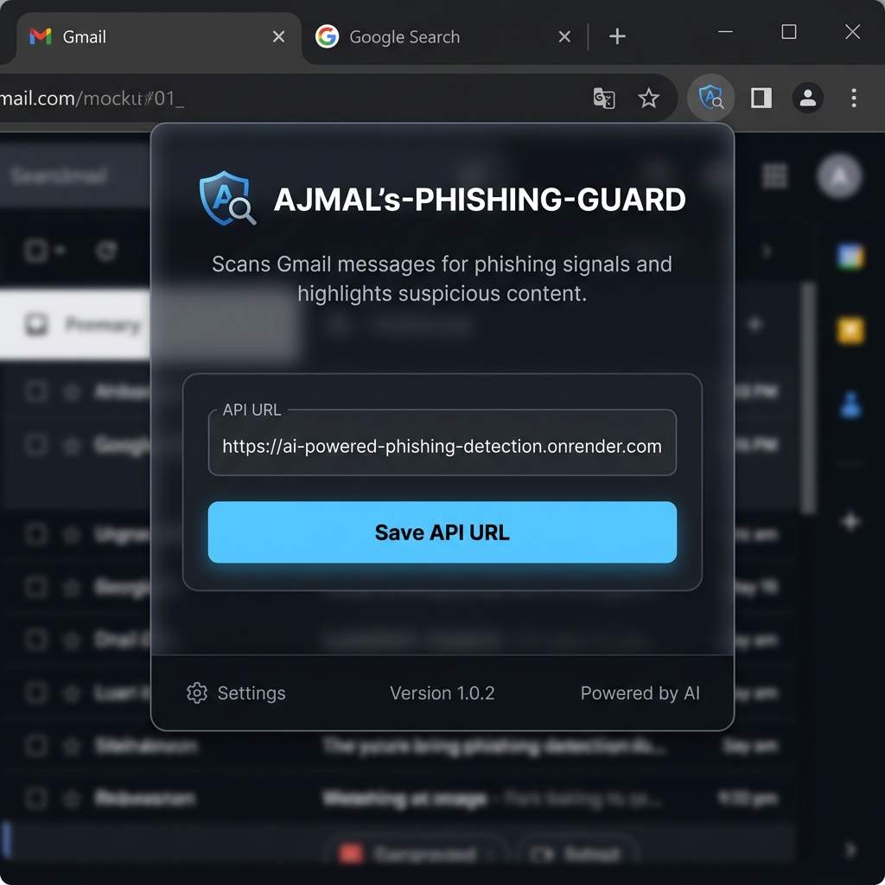
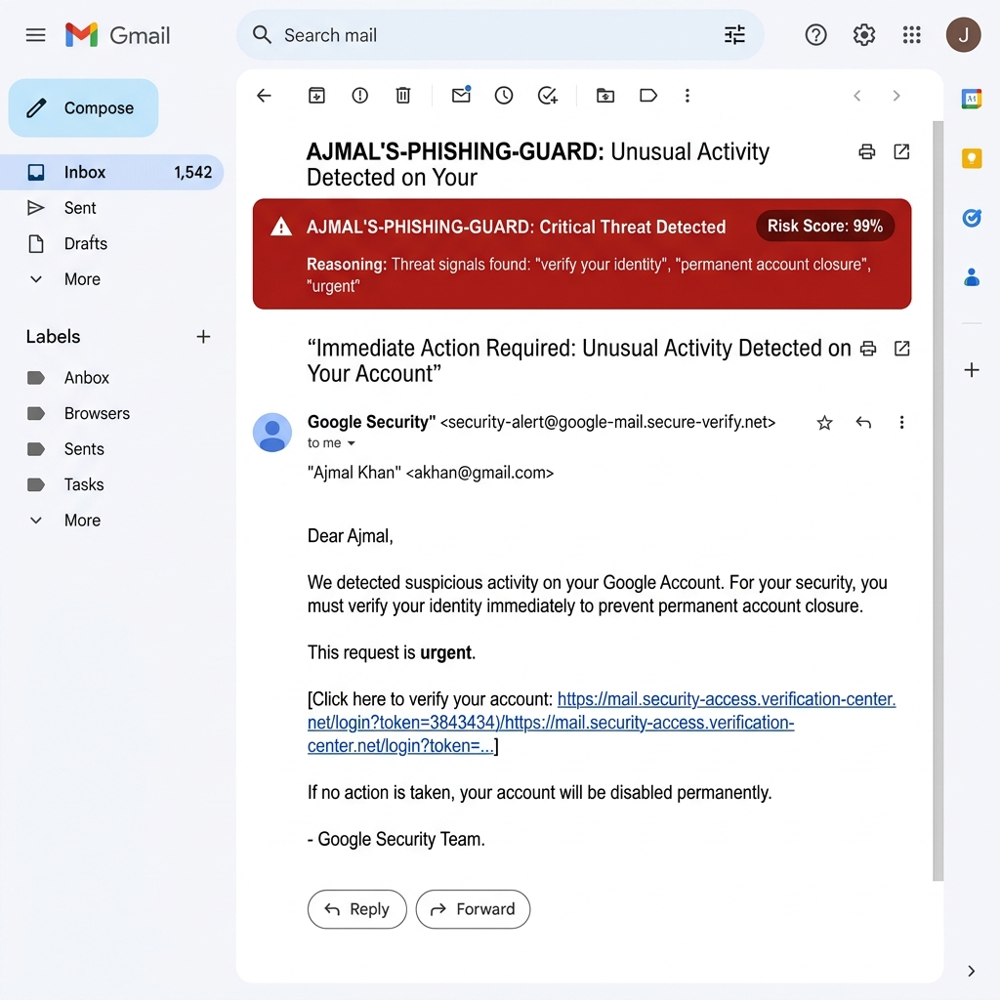

# AJMAL's-PHISHING-GUARD

live:   https://ai-powered-phishing-detection-sigma.vercel.app/

AI-powered phishing detection system with a FastAPI backend, optional DistilBERT inference, explainability hooks, a Next.js dashboard, and a Chrome extension for Gmail.

## What is included

- Backend API for phishing prediction, URL analysis, and explanation endpoints
- Training scaffold for DistilBERT fine-tuning with optional LoRA support
- Next.js frontend dashboard for message and URL inspection
- Chrome extension that flags suspicious Gmail content
- Docker and Redis support for local deployment

## Project layout

```text
phishing-detection-system/
├── backend/
├── training/
├── frontend/
├── extension/
└── README.md
```

## Local development

### Backend

```bash
cd backend
pip install -r requirements.txt
uvicorn app:app --reload --port 5000
```

### Frontend

```bash
cd frontend
npm install
npm run dev
```

Set `NEXT_PUBLIC_API_URL=http://localhost:5000` before starting the frontend.

### Docker

```bash
docker compose -f backend/docker-compose.yml up --build
```

## API endpoints

- `GET /health`
- `POST /predict`
- `POST /analyze-url`
- `POST /explain`

## Chrome Extension (Gmail Phishing Guard)

AJMAL's-PHISHING-GUARD includes a Chrome Extension that integrates directly with Gmail. It scans incoming email content and alerts you to phishing threats in real-time.

### How it works:
1. **Gmail DOM Scanner:** The extension runs a background observer in the active tab. When you open an email, it identifies the email body container (`.a3s`).
2. **API Verification:** It queries the FastAPI backend `/predict` endpoint, transmitting the email text securely.
3. **Dynamic Threat Overlay:** If flagged as phishing, the extension overlays a warning banner directly at the top of the email body and adds a visual red left-border. It highlights the calculated **Risk Score** and **Trigger Signals** (reasoning).
4. **DOM Recycling Protection:** The content script dynamically tracks the text contents and only re-scans if the email content changes, preventing redundant background API calls.

### Installation:
1. Open Google Chrome and navigate to `chrome://extensions/`.
2. Toggle on **Developer mode** (top-right corner).
3. Click **Load unpacked** (top-left corner).
4. Select the `extension/` directory from this project.
5. Pin the extension to your toolbar, click it, enter your backend API URL (e.g., `https://ai-powered-phishing-detection.onrender.com` or `http://localhost:5000`), and click **Save API URL**.

### Screenshots:

<p align="center">
  
  <br>
  <em>AJMAL's-PHISHING-GUARD Extension Configuration Widget</em>
</p>

<br>

<p align="center">
  
  <br>
  <em>Gmail Phishing Warning Banner & Highlight Overlay</em>
</p>

---

## Notes

- If a trained model is present in `backend/phishing_model`, the backend will load it automatically.
- If Redis is unavailable, the backend falls back to an in-memory cache.
- If the ML dependencies are missing, the backend falls back to heuristic scoring so the app still works.

## Training

The training scaffold expects a CSV file with at least a `text` column and an optional `label` column.


